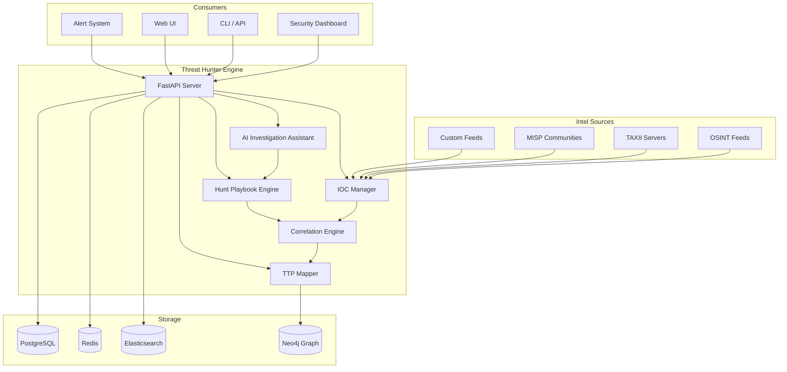

<p align="center">
  
  
  
  
  
  
  
</p>

<p align="center">
  <b>Proactive Threat Hunting Platform</b><br/>
  IOC tracking, attack pattern analysis, MITRE ATT&CK mapping, and AI-powered investigation assistant.
</p>

---

## 📋 Description

**Kirov Threat Hunter** is a proactive threat hunting platform that enables security analysts to systematically search for indicators of compromise (IOCs), adversary tactics, and attack patterns across their infrastructure. It maps every finding to the MITRE ATT&CK framework, correlates intelligence from internal and external sources, and provides an AI investigation assistant that guides analysts through hunts.

The platform supports the full threat hunting lifecycle: hypothesis generation, data collection, pattern analysis, documentation, and remediation tracking. Whether you're hunting based on the latest CISA advisory or investigating anomalous network behavior, Kirov Threat Hunter provides the tooling and intelligence to find threats before they become breaches.

---

## 🏗️ Architecture



---

## ✨ Key Features

- **🎯 MITRE ATT&CK Mapping** — Automatic mapping of IOCs and TTPs to the MITRE ATT&CK v15 framework with coverage heatmaps
- **🔍 IOC Lifecycle Management** — Full lifecycle tracking: ingestion, enrichment, validation, prioritization, and retirement
- **📋 Hunt Playbooks** — Pre-built and custom hunt playbooks with step-by-step guidance, data queries, and expected results
- **🧠 AI Investigation Assistant** — Natural language interface for querying threat data, generating hypotheses, and summarizing findings
- **🔗 Multi-Source Intel Correlation** — Correlates IOCs from OSINT, TAXII, MISP, commercial feeds, and internal telemetry
- **📈 Campaign Tracking** — Groups TTPs, IOCs, and affected assets into adversary campaigns with timeline visualization
- **🕸️ Entity Relationship Graph** — Neo4j-powered graph visualization showing connections between IOCs, assets, adversaries, and campaigns
- **📊 Hunting Metrics** — Coverage analysis, hypothesis success rates, mean time to detect, and hunter productivity dashboards
- **🔄 Automated Intel Sharing** — Publish findings to MISP communities, TAXII collections, and STIX 2.1 bundles
- **🔐 Pivot Analysis** — One-click pivoting from any IOC to discover related indicators and hidden infrastructure

---

## 🛠️ Tech Stack

| Category | Technology |
|----------|-----------|
| **Backend** | FastAPI 0.110+ (Python 3.11+) |
| **Frontend** | React 18 + TypeScript (Vite) |
| **Graph Database** | Neo4j 5 |
| **Search Engine** | Elasticsearch 8 |
| **Relational DB** | PostgreSQL 16 |
| **Cache** | Redis 7 |
| **Intel Formats** | STIX 2.1, TAXII 2.1, MISP JSON |
| **AI/LLM** | OpenAI / Anthropic / Local Ollama |
| **Containerization** | Docker, Docker Compose |
| **Visualization** | D3.js, Cytoscape.js |
| **Task Queue** | Celery + RabbitMQ |

---

## 🚀 Quick Start

### Prerequisites

- Python 3.11+, Docker and Docker Compose
- Neo4j database (included in Docker Compose)
- TAXII server credentials (optional, for external feeds)

### Installation

```bash
# Clone the repository
git clone https://github.com/Raphasha27/kirov-threat-hunter.git
cd kirov-threat-hunter

# Copy environment configuration
cp .env.example .env
# Edit .env with your database credentials and API keys

# Start with Docker Compose
docker compose up -d

# Or for local development:
cd server
python -m venv venv
source venv/bin/activate  # Windows: venv\Scripts\activate
pip install -r requirements.txt
uvicorn app.main:app --reload --port 8000
```

### Load Initial Intel

```bash
# Import STIX bundle
curl -X POST http://localhost:8000/api/v1/intel/import \
  -H "Content-Type: application/json" \
  -d @iocs/feeds/cisa-known-exploited.json

# Add TAXII feed source
curl -X POST http://localhost:8000/api/v1/feeds \
  -H "Content-Type: application/json" \
  -d '{"name": "CISA AIS", "type": "taxii", "url": "https://ais.cisa.gov/" }'
```

### Run Your First Hunt

```bash
# Execute a pre-built hunt playbook
curl -X POST http://localhost:8000/api/v1/hunts/execute \
  -H "Content-Type: application/json" \
  -d '{"playbook": "log4j-scanning", "scope": {"date_range": "7d"}}'
```

---

## 📡 API Overview

| Endpoint | Method | Description |
|----------|--------|-------------|
| `/api/v1/health` | GET | Health check |
| `/api/v1/iocs` | GET | List all IOCs |
| `/api/v1/iocs` | POST | Create new IOC |
| `/api/v1/iocs/:id` | GET | IOC details |
| `/api/v1/iocs/:id/relationships` | GET | IOC relationships graph |
| `/api/v1/hunts` | GET | List hunt campaigns |
| `/api/v1/hunts` | POST | Create new hunt |
| `/api/v1/hunts/:id/execute` | POST | Execute hunt playbook |
| `/api/v1/ttp-mapping` | GET | MITRE ATT&CK coverage map |
| `/api/v1/intel/import` | POST | Import STIX/MISP intel |
| `/api/v1/feeds` | GET | List configured intel feeds |
| `/api/v1/campaigns` | GET | List adversary campaigns |
| `/api/v1/ai/query` | POST | AI investigator query |

---

## 🔗 Integration with Kirov Ecosystem

| Component | Integration |
|-----------|-------------|
| **[Security Dashboard](https://github.com/Raphasha27/kirov-security-dashboard)** | Feeds hunting metrics and IOC dashboards |
| **[AI Security Assistant](https://github.com/Raphasha27/kirov-ai-security-assistant)** | Correlates code vulnerabilities with TTPs |
| **[OSINT Intelligence](https://github.com/Raphasha27/kirov-osint-intelligence)** | Enriches IOCs with dark web and social media intel |
| **[Cyber Automation Engine](https://github.com/Raphasha27/kirov-cyber-automation-engine)** | Triggers automated response playbooks on critical IOC matches |
| **[Network Defense Platform](https://github.com/Raphasha27/kirov-network-defense-platform)** | Feeds network flow data for IOC detection |
| **[Cloud Security Monitor](https://github.com/Raphasha27/kirov-cloud-security-monitor)** | Cloud IAM and resource IOCs |

---

## 🔒 Security Considerations

- **IOC Data Sensitivity**: IOCs may contain sensitive information about your infrastructure. Encrypt at rest and in transit.
- **TAXII Authentication**: Use client certificates or API tokens for TAXII feed connections
- **Neo4j Security**: Enable authentication; restrict network access to the Neo4j container
- **API Access Control**: Implement RBAC — restrict hunt creation to senior analysts, read access to SOC team
- **External Feed Validation**: All ingested IOCs are validated and sanitized to prevent malicious payload injection
- **AI Data Privacy**: Consider self-hosting LLM models when hunting on classified or sensitive networks

---

## 🗺️ Roadmap

- [ ] **Q3 2026** — Active Directory attack path analysis and Kerberoasting/AS-REP hunting
- [ ] **Q3 2026** — Automated hypothesis generation from industry threat reports (PDF parsing)
- [ ] **Q4 2026** — Live hunt collaboration with shared investigation workspaces
- [ ] **Q4 2026** — Sigma rule integration for SIEM correlation
- [ ] **Q1 2027** — Machine learning-based anomaly scoring for unknown TTP detection
- [ ] **Q1 2027** — Deception technology integration (honeypot feed correlation)

---

## 📄 License

This project is licensed under the **MIT License** — see the [LICENSE](LICENSE) file for details.

## 🙏 Attribution

Created and maintained by **Kirov Security Labs** — the research and development division of Kirov, dedicated to advancing AI-driven cybersecurity solutions.

<p align="center">
  <sub>Hunt smarter. Find threats before they find you.</sub>
</p>
